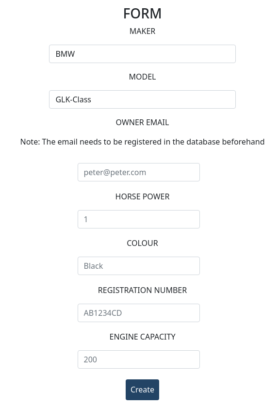
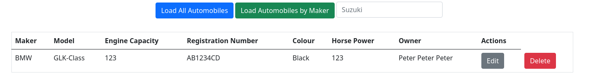

# Automobiles

The Automobiles Project is a REST project, containing the functionality for creating, editing, deleting and searching automobiles.

## Stack
### Front-End:
- HTML
- CSS
- JS
- Bootstrap

### Back-End:
- Java
- Spring Boot
- Spring MVC
- MySQL

## The Functionalities

### Create Automobile

The initial form creates a new Automobile, which will be added on top.

### Edit Automobile

The edit button populates the form with the information of \
the specific car and changes the button from **Create** to **Edit**

### Delete Automobile

On the earlier picture, there is also a **Delete** button.\
The **Delete** button deletes the specified automobile.

### Search

There is a search button and a field.
If there are any automobiles that are made by the specified maker,
they will be visualised in the same table.

## Running the Project

To successfully run the project on a local machine, \
the machine needs to have MySQL installed. \
The credentials should be changed depending on the credentials on the local machine.

When running the API, open the index.html file in the templates folder in the browser.

## TODO
- Refactor the app.js file
- Refactor the index.html file
- Add functionalities for adding new users, new makers and new models 